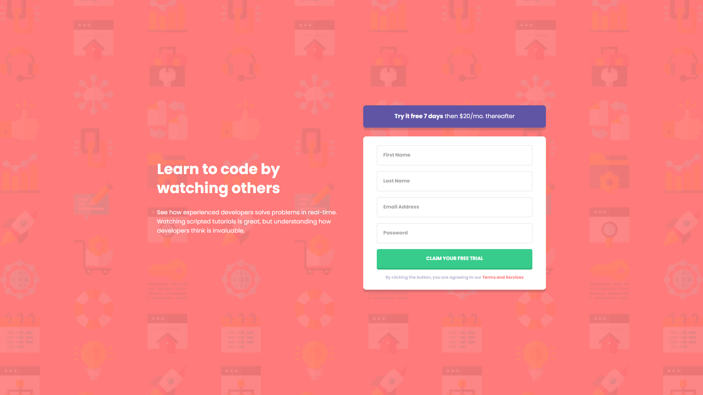

# Frontend Mentor - Intro component with sign up form solution

This is a solution to the [Intro component with sign up form challenge on Frontend Mentor](https://www.frontendmentor.io/challenges/intro-component-with-signup-form-5cf91bd49edda32581d28fd1).

## Table of contents

- [Overview](#overview)
  - [The challenge](#the-challenge)
  - [Screenshot](#screenshot)
  - [Links](#links)
- [My process](#my-process)
  - [Built with](#built-with)
  - [What I learned](#what-i-learned)
  - [Continued development](#continued-development)
  - [Useful resources](#useful-resources)

## Overview

### The challenge

Your task is to build out the project to the designs inside the `/design` folder. You will find both a mobile and a desktop version of the design. 

The designs are in JPG static format. Using JPGs will mean that you'll need to use your best judgment for styles such as `font-size`, `padding` and `margin`. 

Users should be able to:

- View the optimal layout for the site depending on their device's screen size
- See hover states for all interactive elements on the page
- Receive an error message when the `form` is submitted if:
  - Any `input` field is empty. The message for this error should say *"[Field Name] cannot be empty"*
  - The email address is not formatted correctly (i.e. a correct email address should have this structure: `name@host.tld`). The message for this error should say *"Looks like this is not an email"*

### Screenshot

I've included 5 screenshots in the `/screenshots` folder: mobile, tablet, desktop, fullscreen,
and active states for invalid inputs. 

### Links

- [Solution URL](https://www.frontendmentor.io/solutions/mobilefirst-solution-using-bem-and-flexbox-3qytXwlpd)
- [Live Site URL](https://lnkd.in/gTe_VN49)

## My process

I started with the HTML while looking at the desktop version. I then did the CSS for the mobile version
and gradually expanded from there to the tablet then dektoo. 

The JavaScript came last once I had the layout figured out, and everything was responsive.

### Built with

- Semantic HTML5 markup
- CSS custom properties
- Flexbox
- Mobile-first workflow
- Vanilla JavaScript

### What I learned

I haven't used forms or inputs in a long time, so this project was the perfect way to practice working
with forms once again. I read and practiced for a fair amount of time before starting just to get back into 
the swing of things. 

In the process, I learned a lot about all the different types of inputs, styling inputs, placeholders,
validation using JavaScript, etc. 

I also don't use JavaScript as much as I should, so I'm glad I embarked on this prject to practice it. 
It wasn't exactly difficult, but it gave me a good JS workout. 

### Continued development

I wasn't timing myself on this one, but I'm satisfied with the amount of time I spent on it. I hope to 
continue practicing with more JavaScript on the front end and get better on that front as well. 

I'd also like to work on some more challenges with forms to get even more comfortable with it.

### Useful resources

I find myself going through CSS selectors from [w3schools](https://www.w3schools.com/cssref/css_selectors.asp)
often, so I might as well include it as a useful resource.

I've deleted this section in previous projects, but I opted to keep it this time just for future reference. I
also read up quite a bit on [forms and inputs](https://www.w3schools.com/html/html_form_attributes.asp) which
helped out in completing this project.